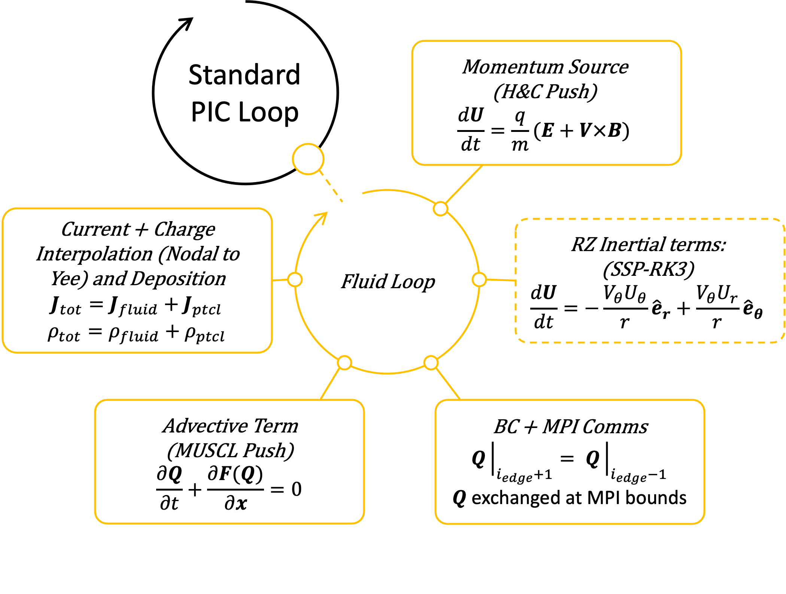

.. _theory-cold-fluid-model:

Cold Relativistic Fluid Model
==========================

An alternate model for the plasma particle representation, is the cold relativistic fluid model. 
The cold relativistic fluid model is typically faster to compute than 
particles and useful to replace particles when kinetic effects are negligble. This
can be done for certain parts of the plasma, such as the background plasma while leaving 
particle beams overlaid. The two models then couple through maxwells equations.

In the cold limit (zero internal pressure) of a relativistic plasma, the Maxwell-Fluid 
equations govern the plasma evolution. The fluid equations in the lab frame per species,
 s, are given by,

.. math::

   \frac{\partial N_s}{\partial t} + \nabla \cdot (N_s\mathbf{V}_s) &= 0 \\
   \frac{\partial (N\mathbf{U})_s}{\partial t} + \nabla \cdot ((N\mathbf{U})_s\mathbf{V}_s) &= \frac{q_sN_s}{m_s}(\mathbf{E}_s + \mathbf{V}_s \times \mathbf{B}_s).

Where the fields are updated via Maxwell's equations,

.. math::

   \nabla \cdot \mathbf{E} &= \frac{\rho}{\varepsilon_0} \\
   \nabla \cdot \mathbf{B} &= 0 \\
   \nabla \times \mathbf{E} &= -\frac{\partial \mathbf{B}}{\partial t} \\
   \nabla \times \mathbf{B} &= \mu_0 \mathbf{J} + \mu_0 \varepsilon_0 \frac{\partial \mathbf{E}}{\partial t}.

The fluids are coupled to the fields through,

.. math::

   \rho &= \rho_{ptcl}+\sum_s q_sN_s \\
   \mathbf{J} &= \mathbf{J}_{ptcl}+\sum_s q_sN_s\mathbf{V}_s \\
   \mathbf{V}_s &= \frac{ (N\mathbf{U})_s }{ \sqrt{ N_s^2 + (N\mathbf{U})_s^2/c^2} } \\
   (N\mathbf{U})_s &= N_s\mathbf{U}_s

where the particle quantities are calculated by the PIC algorithm. 

Implementation details
-------------------

The fluid timeloop is embedded inside the standard PIC timeloop and consists of 
the following steps: 1. H&C push of the momentum 2. Non-inertial (momentum source) 
terms 3. boundary conditions and and and MPI Communications 4. MUSCL 
scheme for advection terms 5. Current and Charge Deposition. The figure here gives 
a visual representation of these steps, and we describe each of these in more detail.

Step 0: **Preperation**
    Before the fluid loop begins, it is assumed that the program is in the state where fields :math:`\mathbf{E}` 
    and :math:`\mathbf{B}` are available at the half timestep of the fluids. The 
    fluids themselves are arrays on our nodal grid of the density and 
    momentum density, :math:`\mathbf{Q} \equiv \{ N, NU_x, NU_y, NU_z \}`.

Step 1: **Higeura and Cary Push**
    The time staggering of the fields is used by the momentum source term, which is source-
    split and solved with a the Higeura and Cary push (Higura et al, 2017). We do not adopt spatial 
    grid staggering, all discritized fluid quantities exist on the nodal grid. External fields 
    can be included at this step.

Step 2: **Non-interial Terms**
    In RZ, the diverence of the flux terms has aditional non-zero elements outside of the
    derivitives. These are Strang split and solved with a TVD RK3 method (Osher et al, 1988). 

Step 3: **Boundary Conditions and Comms**
    At this point we apply BCs (copy BC for the fluids) and we exchange gaurd cells between
    MPI ranks in preperation of derivative terms in the next advective step.

Step 4: **Advective Push**
    For the advective term, we update this with a MUSCL scheme using low-diffusion minmod slope 
    limiting. We further simplify the conservative equations in terms of primitive 
    variables, :math:`\{ N, U_x, U_y, U_z \}`. Which we found to be 
    more stable than conservative variables for the MUSCL reconstruction. Once we've
    reconstructed the solution in the MUSCL scheme for teh half-timestep, we convert
    these quantities back to their conservative forms for the total update to maintain
    the conservation laws.  

Step 5: **Current and Charge Deposition**
    Once this series of steps is complete and the fluids have been evolved by an entire 
    timestep. We then deposit the current and charge onto the total current and charge 
    densities.

*Some extra notes:* The algorithm is safe with zero fluid density. It also implements a 
positivity limiter on the density to prevent negative density regions from forming.
There is currently no ability to mode-decompose in RZ, and none boundaries are handled by
default. 
More details of the computations are given in an extended writeup (contact: grj@princeton.edu). 

.. raw:: html

   

.. raw:: html

   

Higuera, Adam V., and John R. Cary. "Structure-preserving second-order integration of relativistic charged particle trajectories in electromagnetic fields." Physics of Plasmas 24.5 (2017).

.. raw:: html

   

.. raw:: html

   

Osher, Stanley, and Chi-Wang Shu. "Efficient implementation of essentially non-oscillatory shock-capturing schemes." J. Comput. Phys 77.2 (1988): 439-471.