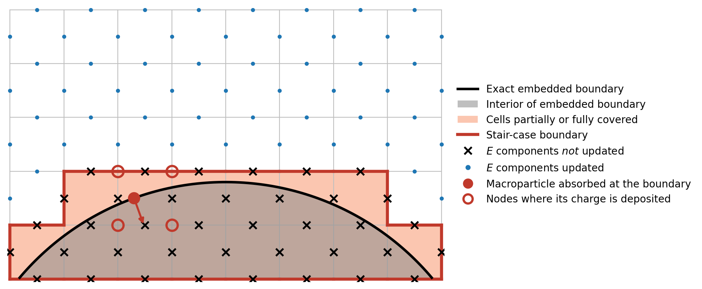
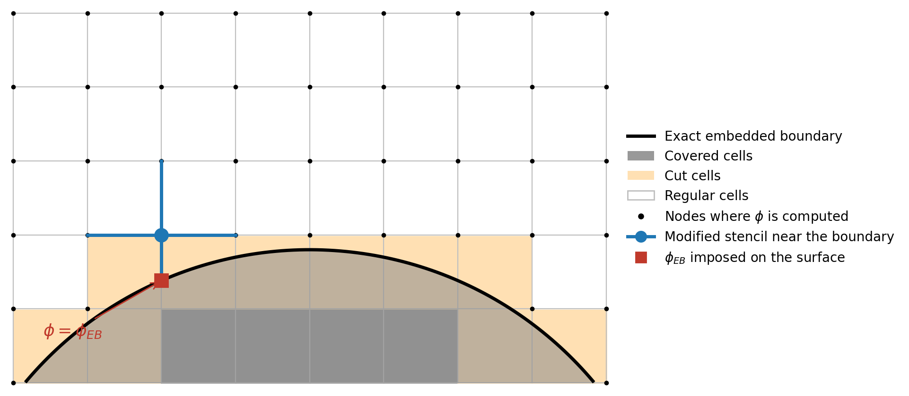

.. _theory-eb:

Embedded boundaries
===================

WarpX simulations can include **embedded boundaries**, i.e., boundaries of arbitrary shape
(e.g., electrodes, curved conducting walls) that are *embedded* inside the simulation domain,
and that can intersect the grid cells in an arbitrary manner. (This is in contrast to the
boundaries of the simulation box, which conform to the grid and which are described
:ref:`here <theory-bc>`.) The shape of the embedded boundary is defined by the user,
either with an implicit function or with an STL file
(see the :ref:`corresponding input parameters <running-cpp-parameters-eb>`).

Internally, WarpX relies on the embedded-boundary representation of
`AMReX <https://amrex-codes.github.io/amrex/docs_html/EB_Chapter.html>`__. Based on the
user-provided shape, AMReX computes geometric information on how the embedded boundary
intersects the simulation grid, including:

    - which cells are fully covered by the embedded boundary ("covered cells"), partially
      covered ("cut cells"), or not covered at all ("regular cells");
    - the fraction of each cell, cell face, and cell edge that is covered by the embedded boundary;
    - the level-set function, i.e., the signed distance to the surface of the embedded
      boundary, evaluated at the grid nodes.

The field solvers and the particle pusher use this information in different ways,
as described below.

.. _theory-eb-fields:

Embedded boundary condition for the fields
------------------------------------------

Electromagnetic solvers: stair-case approximation
~~~~~~~~~~~~~~~~~~~~~~~~~~~~~~~~~~~~~~~~~~~~~~~~~

When using the :ref:`electromagnetic solvers <theory-mwsolve>`, the embedded boundary is
treated as a perfect electric conductor, i.e., a boundary at which the tangential electric
field and the normal magnetic field vanish.

With the exception of the ECT solver (see below), the finite-difference electromagnetic
solvers use a **stair-case approximation** of the embedded boundary: since the field
components are defined on the edges and faces of the (staggered) Yee grid, the exact, smooth
surface of the embedded boundary is effectively replaced by a stair-case surface made up of
cell faces. More specifically, WarpX flags the electric and magnetic field components whose
position on the grid touches a cell that is partially or fully covered by the embedded
boundary. These components are skipped by the Maxwell solver, and thus remain at their
initial value (typically zero) throughout the simulation, as illustrated in the figure below.

.. _fig_eb_staircase:

   Stair-case representation of the embedded boundary used by the finite-difference
   electromagnetic solvers (2D schematic). The electric field components marked with a
   black cross touch a cell that is partially or fully covered by the embedded boundary,
   and are therefore never updated by the Maxwell solver. The red circles show the grid
   nodes where a macroparticle absorbed at the exact surface of the embedded boundary
   deposits its charge, for an order-1 shape factor.

Note that, with the above definition, the region where the fields are *not* updated strictly
contains the exact surface of the embedded boundary (i.e., the stair-case boundary lies on the
vacuum side of the exact surface). This choice is important for **charge conservation**:
particles are absorbed (or emitted) at the *exact* surface of the embedded boundary
(see :ref:`below <theory-eb-particles>`), i.e., inside a cell that is partially covered.
As a result, at the time when it is removed from (or introduced in) the simulation, a
macroparticle with an order-1 shape factor deposits charge only at grid nodes that are
surrounded by non-updated field components (see the red circles in the above figure).
Its disappearance (or appearance) therefore does not leave any spurious error in Gauss's law
(:math:`\nabla \cdot \boldsymbol{E} = \rho/\epsilon_0`) in the region where the fields are
updated. (See `this pull request <https://github.com/BLAST-WarpX/warpx/pull/5534>`__ for more
details.) When a higher-order shape factor is selected by the user, WarpX automatically
reduces the deposition to an order-1 shape for particles that are close to the embedded
boundary, so that they never deposit charge in a cell that is partially or fully covered,
and so that the above property is preserved.

The exception to the above stair-case representation is the ECT (Enlarged Cell Technique)
solver (selected by setting :pp:param:`algo.maxwell_solver` = ``ect``), which instead uses a
**cut-cell (conformal)** representation of the embedded boundary :cite:p:`eb-XiaoIEEE2005`.
In this case, the magnetic field components are updated by integrating Faraday's law over the
exact fraction of each cell face that is not covered by the embedded boundary (using the
corresponding partial face areas and edge lengths computed by AMReX). Since faces that are
almost entirely covered would normally impose a severe constraint on the stable time step,
the ECT solver "enlarges" these small faces by borrowing area from their neighbors, which
preserves stability at the standard CFL time step. This cut-cell representation is more
accurate than the stair-case approximation.

Electrostatic solvers: cut-cell representation
~~~~~~~~~~~~~~~~~~~~~~~~~~~~~~~~~~~~~~~~~~~~~~

When using the :ref:`electrostatic solvers <theory-electrostatic-pic>`, the embedded boundary
is treated as a conductor held at a given electric potential :math:`\phi_{EB}`, which can be
specified by the user as a function of space and time with the
:pp:param:`warpx.eb_potential(x,y,z,t)` parameter. The Poisson equation is then solved in the
region outside of the embedded boundary, with the Dirichlet boundary condition
:math:`\phi = \phi_{EB}` imposed on the surface of the embedded boundary.

In contrast to the finite-difference electromagnetic solvers, the electrostatic solver uses a
**cut-cell** representation of the embedded boundary (see the
`AMReX documentation <https://amrex-codes.github.io/amrex/docs_html/EB_Chapter.html>`__):
close to the embedded boundary, the finite-difference stencil of the Laplacian operator is
modified so as to take into account the exact position at which the surface of the embedded
boundary intersects the grid lines. As illustrated in the figure below, when one of the arms
of the stencil crosses the surface of the embedded boundary, it is shortened so that the
boundary value :math:`\phi_{EB}` is imposed exactly at the intersection with the surface.
The position of the embedded boundary is thus resolved with sub-cell accuracy, which makes
this representation more accurate than the stair-case approximation. The same representation
is used for the magnetostatic (vector potential) solver.

.. _fig_eb_cutcell:

   Cut-cell representation of the embedded boundary used by the electrostatic solver
   (2D schematic). The electric potential :math:`\phi` is computed at the grid nodes outside
   of the embedded boundary. For nodes next to the embedded boundary, the finite-difference
   stencil is modified: the arm that crosses the surface is shortened, and the boundary
   value :math:`\phi_{EB}` is imposed at the exact intersection with the surface.

.. _theory-eb-particles:

Embedded boundary condition for the particles
---------------------------------------------

Particles are always **absorbed** at the embedded boundary. At each time step, after the
particle push, WarpX evaluates the level-set function (i.e., the signed distance to the
surface of the embedded boundary) at the position of each particle, by interpolation from the
grid nodes. Particles that are found to be inside the embedded boundary are removed from the
simulation. Note that, because this procedure relies on the level-set function, particles are
absorbed at the *exact*, smooth surface of the embedded boundary -- not at its stair-case
approximation -- including when using the electromagnetic solvers.

The properties (position, momentum, etc.) of the particles that are absorbed at the embedded
boundary can be recorded with a ``BoundaryScrapingDiagnostics`` (by setting
:pp:param:`<species_name>.save_particles_at_eb` = ``1``), e.g., in order to compute particle
fluxes onto the embedded boundary.

Conversely, particles can also be *emitted* from the surface of the embedded boundary, using
flux injection (see the :ref:`particle initialization parameters
<running-cpp-parameters-particle>`, and in particular
``<species_name>.inject_from_embedded_boundary``).

.. bibliography::
   :keyprefix: eb-
