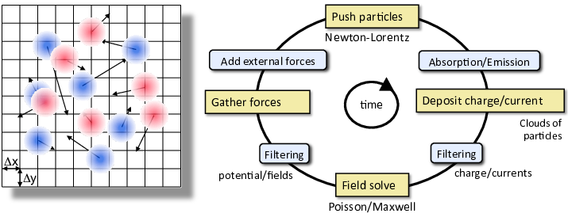

.. _theory:

Models & Algorithms
===================

.. _theory-pic:

In the *particle-in-cell method* :cite:p:`i-Birdsalllangdon`,
the electromagnetic fields are solved on a discretized grid while particles are
evolved in continuous space. A high-level schematic of the method is shown in the
figure below with details of the different field solvers, particle handling algorithms,
additional physics modules, etc. described in the sections linked further down.

.. _fig-pic:

lds. The core PIC algorithm involves four operations at each time step: 1) evolve the velocity and position of the particles using the Newton-Lorentz equations, 2) deposit the charge and/or current densities through interpolation from the particles distributions onto the grid, 3) evolve Maxwell’s wave equations (for electromagnetic) or solve Poisson’s equation (for electrostatic) on the grid, 4) interpolate the fields from the grid onto the particles for the next particle push. Additional “add-ons” operations are inserted between these core operations to account for additional physics (e.g. absorption/emission of particles, addition of external forces to account for accelerator focusing or accelerating component) or numerical effects (e.g. smoothing/filtering of the charge/current densities and/or fields on the grid).

   The Particle-In-Cell (PIC) method follows the evolution of a collection of charged macro-particles (positively charged in blue on the left plot, negatively charged in red) that evolve self-consistently with their electromagnetic (or electrostatic) fields. The core PIC algorithm involves four operations at each time step: 1) evolve the velocity and position of the particles using the Newton-Lorentz equations, 2) deposit the charge and/or current densities through interpolation from the particles distributions onto the grid, 3) evolve Maxwell’s wave equations (for electromagnetic) or solve Poisson’s equation (for electrostatic) on the grid, 4) interpolate the fields from the grid onto the particles for the next particle push. Additional “add-ons” operations are inserted between these core operations to account for additional physics (e.g. absorption/emission of particles, addition of external forces to account for accelerator focusing or accelerating component) or numerical effects (e.g. smoothing/filtering of the charge/current densities and/or fields on the grid).

.. figure:: Plasma_acceleration_sim.png
   :alt: Plasma acceleration diagram

   Plasma laser-driven (top) and charged-particles-driven (bottom) acceleration (rendering from 3-D Particle-In-Cell simulations). A laser beam (red and blue disks in top picture) or a charged particle beam (red dots in bottom picture) propagating (from left to right) through an under-dense plasma (not represented) displaces electrons, creating a plasma wakefield that supports very high electric fields (pale blue and yellow). These electric fields, which can be orders of magnitude larger than with conventional techniques, can be used to accelerate a short charged particle beam (white) to high-energy over a very short distance.

Computer simulations have had a profound impact on the design and understanding of past and present plasma acceleration experiments :cite:p:`i-Tsungpop06,i-Geddesjp08,i-Geddesscidac09,i-Geddespac09,i-Huangscidac09`. Accurate modeling of wake formation, electron self-trapping and acceleration require fully kinetic methods (usually Particle-In-Cell) using large computational resources due to the wide range of space and time scales involved. Numerical modeling complements and guides the design and analysis of advanced accelerators, and can reduce development costs significantly. Despite the major recent experimental successes :cite:p:`i-LeemansPRL2014,i-Blumenfeld2007,i-BulanovSV2014,i-Steinke2016`, the various advanced acceleration concepts need significant progress to fulfill their potential. To this end, large-scale simulations will continue to be a key component toward reaching a detailed understanding of the complex interrelated physics phenomena at play.

For such simulations,
the most popular algorithm is the Particle-In-Cell (or PIC) technique,
which represents electromagnetic fields on a grid and particles by
a sample of macroparticles.
However, these simulations are extremely computationally intensive, due to the need to resolve the evolution of a driver (laser or particle beam) and an accelerated beam into a structure that is orders of magnitude longer and wider than the accelerated beam.
Various techniques or reduced models have been developed to allow multidimensional simulations at manageable computational costs: quasistatic approximation :cite:p:`i-Sprangleprl90,i-Antonsenprl1992,i-Krallpre1993,i-Morapop1997,i-Quickpic`,
ponderomotive guiding center (PGC) models :cite:p:`i-Antonsenprl1992,i-Krallpre1993,i-Quickpic,i-Benedettiaac2010,i-Cowanjcp11`, simulation in an optimal Lorentz boosted frame :cite:p:`i-Vayprl07,i-Bruhwileraac08,i-Vayscidac09,i-Vaypac09,i-Martinspac09,i-VayAAC2010,i-Martinsnaturephysics10,i-Martinspop10,i-Martinscpc10,i-Vayjcp2011,i-VayPOPL2011,i-Vaypop2011,i-Yu2016`,
expanding the fields into a truncated series of azimuthal modes :cite:p:`i-godfrey1985iprop,i-LifschitzJCP2009,i-DavidsonJCP2015,i-Lehe2016,i-AndriyashPoP2016`, fluid approximation :cite:p:`i-Krallpre1993,i-Shadwickpop09,i-Benedettiaac2010` and scaled parameters :cite:p:`i-Cormieraac08,i-Geddespac09`.

Field Solvers
-------------

.. toctree::
   :maxdepth: 1

   maxwell_solvers
   kinetic_fluid_hybrid_model

Grid & Geometries
-----------------

Boundary Conditions
-------------------

.. toctree::
   :maxdepth: 1

   boundary_conditions

Species Representations
-----------------------

.. toctree::
   :maxdepth: 1

   kinetic_particles
   cold_fluid_model

Multiphysics Processes
----------------------

.. toctree::
   :maxdepth: 1

   multiphysics_extensions

Advanced Modes of Running
-------------------------

.. toctree::
   :maxdepth: 1

   amr
   boosted_frame

.. bibliography::
    :keyprefix: i-
