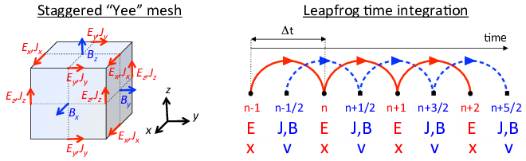

.. _theory-pic:

Particle-in-Cell Method
=======================

.. _fig-pic:

.. figure:: PIC.png
   :alt: [fig:PIC] The Particle-In-Cell (PIC) method follows the evolution of a collection of charged macro-particles (positively charged in blue on the left plot, negatively charged in red) that evolve self-consistently with their electromagnetic (or electrostatic) fields. The core PIC algorithm involves four operations at each time step: 1) evolve the velocity and position of the particles using the Newton-Lorentz equations, 2) deposit the charge and/or current densities through interpolation from the particles distributions onto the grid, 3) evolve Maxwell’s wave equations (for electromagnetic) or solve Poisson’s equation (for electrostatic) on the grid, 4) interpolate the fields from the grid onto the particles for the next particle push. Additional “add-ons” operations are inserted between these core operations to account for additional physics (e.g. absorption/emission of particles, addition of external forces to account for accelerator focusing or accelerating component) or numerical effects (e.g. smoothing/filtering of the charge/current densities and/or fields on the grid).

   The Particle-In-Cell (PIC) method follows the evolution of a collection of charged macro-particles (positively charged in blue on the left plot, negatively charged in red) that evolve self-consistently with their electromagnetic (or electrostatic) fields. The core PIC algorithm involves four operations at each time step: 1) evolve the velocity and position of the particles using the Newton-Lorentz equations, 2) deposit the charge and/or current densities through interpolation from the particles distributions onto the grid, 3) evolve Maxwell’s wave equations (for electromagnetic) or solve Poisson’s equation (for electrostatic) on the grid, 4) interpolate the fields from the grid onto the particles for the next particle push. Additional “add-ons” operations are inserted between these core operations to account for additional physics (e.g. absorption/emission of particles, addition of external forces to account for accelerator focusing or accelerating component) or numerical effects (e.g. smoothing/filtering of the charge/current densities and/or fields on the grid).

In the *electromagnetic particle-in-cell method* :cite:p:`pt-Birdsalllangdon,pt-HockneyEastwoodBook`,
the electromagnetic fields are solved on a grid, usually using Maxwell’s
equations

.. math::
   \frac{\mathbf{\partial B}}{\partial t} = -\nabla\times\mathbf{E}
   :label: Faraday-1

.. math::
   \frac{\mathbf{\partial E}}{\partial t} = \nabla\times\mathbf{B}-\mathbf{J}
   :label: Ampere-1

.. math::
   \nabla\cdot\mathbf{E} = \rho
   :label: Gauss-1

.. math::
   \nabla\cdot\mathbf{B} = 0
   :label: divb-1

given here in natural units (:math:`\epsilon_0=\mu_0=c=1`), where :math:`t` is time, :math:`\mathbf{E}` and
:math:`\mathbf{B}` are the electric and magnetic field components, and
:math:`\rho` and :math:`\mathbf{J}` are the charge and current densities. The
charged particles are advanced in time using the Newton-Lorentz equations
of motion

.. math::
   \frac{d\mathbf{x}}{dt} = \mathbf{v},
   :label: Lorentz_x-1

.. math::
   \frac{d\left(\gamma\mathbf{v}\right)}{dt} = \frac{q}{m}\left(\mathbf{E}+\mathbf{v}\times\mathbf{B}\right),
   :label: Lorentz_v-1

where :math:`m`, :math:`q`, :math:`\mathbf{x}`, :math:`\mathbf{v}` and :math:`\gamma=1/\sqrt{1-v^{2}}`
are respectively the mass, charge, position, velocity and relativistic
factor of the particle given in natural units (:math:`c=1`). The charge and current densities are interpolated
on the grid from the particles’ positions and velocities, while the
electric and magnetic field components are interpolated from the grid
to the particles’ positions for the velocity update.

.. _theory-pic-push:

Particle push
-------------

A centered finite-difference discretization of the Newton-Lorentz
equations of motion is given by

.. math::
   \frac{\mathbf{x}^{i+1}-\mathbf{x}^{i}}{\Delta t} = \mathbf{v}^{i+1/2},
   :label: leapfrog_x

.. math::
   \frac{\gamma^{i+1/2}\mathbf{v}^{i+1/2}-\gamma^{i-1/2}\mathbf{v}^{i-1/2}}{\Delta t} = \frac{q}{m}\left(\mathbf{E}^{i}+\mathbf{\bar{v}}^{i}\times\mathbf{B}^{i}\right).
   :label: leapfrog_v

In order to close the system, :math:`\bar{\mathbf{v}}^{i}` must be
expressed as a function of the other quantities. The two implementations that have become the most popular are presented below.

.. _theory-pic-push-boris:

Boris relativistic velocity rotation
~~~~~~~~~~~~~~~~~~~~~~~~~~~~~~~~~~~~

The solution proposed by Boris :cite:p:`pt-BorisICNSP70` is given by

.. math::
   \mathbf{\bar{v}}^{i} = \frac{\gamma^{i+1/2}\mathbf{v}^{i+1/2}+\gamma^{i-1/2}\mathbf{v}^{i-1/2}}{2\bar{\gamma}^{i}}
   :label: boris_v

where :math:`\bar{\gamma}^{i}` is defined by :math:`\bar{\gamma}^{i} \equiv (\gamma^{i+1/2}+\gamma^{i-1/2} )/2`.

The system (:eq:`leapfrog_v`, :eq:`boris_v`) is solved very
efficiently following Boris’ method, where the electric field push
is decoupled from the magnetic push. Setting :math:`\mathbf{u}=\gamma\mathbf{v}`, the
velocity is updated using the following sequence:

.. math::

   \begin{aligned}
   \mathbf{u^{-}}     & = \mathbf{u}^{i-1/2}+\left(q\Delta t/2m\right)\mathbf{E}^{i}
   \\
   \mathbf{u'}        & = \mathbf{u}^{-}+\mathbf{u}^{-}\times\mathbf{t}
   \\
   \mathbf{u}^{+}     & = \mathbf{u}^{-}+\mathbf{u'}\times2\mathbf{t}/(1+\mathbf{t}^{2})
   \\
   \mathbf{u}^{i+1/2} & = \mathbf{u}^{+}+\left(q\Delta t/2m\right)\mathbf{E}^{i}
   \end{aligned}

where :math:`\mathbf{t}=\left(q\Delta t/2m\right)\mathbf{B}^{i}/\bar{\gamma}^{i}` and where
:math:`\bar{\gamma}^{i}` can be calculated as :math:`\bar{\gamma}^{i}=\sqrt{1+(\mathbf{u}^-/c)^2}`.

The Boris implementation is second-order accurate, time-reversible and fast. Its implementation is very widespread and used in the vast majority of PIC codes.

.. _theory-pic-push-vay:

Vay Lorentz-invariant formulation
~~~~~~~~~~~~~~~~~~~~~~~~~~~~~~~~~

It was shown in :cite:t:`pt-Vaypop2008` that the Boris formulation is
not Lorentz invariant and can lead to significant errors in the treatment
of relativistic dynamics. A Lorentz invariant formulation is obtained
by considering the following velocity average

.. math::
   \mathbf{\bar{v}}^{i} = \frac{\mathbf{v}^{i+1/2}+\mathbf{v}^{i-1/2}}{2}.
   :label: new_v

This gives a system that is solvable analytically (see :cite:t:`pt-Vaypop2008`
for a detailed derivation), giving the following velocity update:

.. math::
   \mathbf{u^{*}} = \mathbf{u}^{i-1/2}+\frac{q\Delta t}{m}\left(\mathbf{E}^{i}+\frac{\mathbf{v}^{i-1/2}}{2}\times\mathbf{B}^{i}\right),
   :label: pusher_gamma

.. math::
   \mathbf{u}^{i+1/2} = \frac{\mathbf{u^{*}}+\left(\mathbf{u^{*}}\cdot\mathbf{t}\right)\mathbf{t}+\mathbf{u^{*}}\times\mathbf{t}}{1+\mathbf{t}^{2}},
   :label: pusher_upr

where

.. math::

   \begin{align}
   \mathbf{t} & = \boldsymbol{\tau}/\gamma^{i+1/2},
   \\
   \boldsymbol{\tau} & = \left(q\Delta t/2m\right)\mathbf{B}^{i},
   \\
   \gamma^{i+1/2} & = \sqrt{\sigma+\sqrt{\sigma^{2}+\left(\boldsymbol{\tau}^{2}+w^{2}\right)}},
   \\
   w & = \mathbf{u^{*}}\cdot\boldsymbol{\tau},
   \\
   \sigma & = \left(\gamma'^{2}-\boldsymbol{\tau}^{2}\right)/2,
   \\
   \gamma' & = \sqrt{1+(\mathbf{u}^{*}/c)^{2}}.
   \end{align}

This Lorentz invariant formulation
is particularly well suited for the modeling of ultra-relativistic
charged particle beams, where the accurate account of the cancellation
of the self-generated electric and magnetic fields is essential, as
shown in :cite:t:`pt-Vaypop2008`.

.. _theory-pic-mwsolve:

Field solve
-----------

Various methods are available for solving Maxwell’s equations on a
grid, based on finite-differences, finite-volume, finite-element,
spectral, or other discretization techniques that apply most commonly
on single structured or unstructured meshes and less commonly on multiblock
multiresolution grid structures. In this chapter, we summarize the widespread
second order finite-difference time-domain (FDTD) algorithm, its extension
to non-standard finite-differences as well as the pseudo-spectral
analytical time-domain (PSATD) and pseudo-spectral time-domain (PSTD)
algorithms. Extension to multiresolution (or mesh refinement) PIC
is described in, e.g., :cite:t:`pt-VayCSD12,pt-Vaycpc04`.

.. _fig_yee_grid:

 integrator.

   (left) Layout of field components on the staggered “Yee” grid. Current densities and electric fields are defined on the edges of the cells and magnetic fields on the faces. (right) Time integration using a second-order finite-difference "leapfrog" integrator.

.. _theory-pic-mwsolve-fdtd:

Finite-Difference Time-Domain (FDTD)
~~~~~~~~~~~~~~~~~~~~~~~~~~~~~~~~~~~~

The most popular algorithm for electromagnetic PIC codes is the Finite-Difference
Time-Domain (or FDTD) solver

.. math::
   D_{t}\mathbf{B} = -\nabla\times\mathbf{E}
   :label: Faraday-2

.. math::
   D_{t}\mathbf{E} = \nabla\times\mathbf{B}-\mathbf{J}
   :label: Ampere-2

.. math::
   \left[\nabla\cdot\mathbf{E} = \rho\right]
   :label: Gauss-2

.. math::
   \left[\nabla\cdot\mathbf{B} = 0\right].
   :label: divb-2

The differential operator is defined as :math:`\nabla=D_{x}\mathbf{\hat{x}}+D_{y}\mathbf{\hat{y}}+D_{z}\mathbf{\hat{z}}`
and the finite-difference operators in time and space are defined
respectively as

.. math::

   \begin{align}
   D_{t}G|_{i,j,k}^{n} & = \frac{(G|_{i,j,k}^{n+1/2}-G|_{i,j,k}^{n-1/2})}{\Delta t},
   \\
   D_{x}G|_{i,j,k}^{n} & = \frac{G|_{i+1/2,j,k}^{n}-G|_{i-1/2,j,k}^{n}}{\Delta x},
   \end{align}

where :math:`\Delta t` and :math:`\Delta x` are respectively the time step and
the grid cell size along :math:`x`, :math:`n` is the time index and :math:`i`, :math:`j`
and :math:`k` are the spatial indices along :math:`x`, :math:`y` and :math:`z` respectively.
The difference operators along :math:`y` and :math:`z` are obtained by circular
permutation. The equations in brackets are given for completeness,
as they are often not actually solved, thanks to the usage of a so-called
charge conserving algorithm, as explained below. As shown in :numref:`fig_yee_grid`,
the quantities are given on a staggered (or “Yee”)
grid :cite:p:`pt-Yee`, where the electric field components are located
between nodes and the magnetic field components are located in the
center of the cell faces. Knowing the current densities at half-integer steps,
the electric field components are updated alternately with the magnetic
field components at integer and half-integer steps respectively.

.. _theory-pic-mwsolve-nsfdtd:

Non-Standard Finite-Difference Time-Domain (NSFDTD)
~~~~~~~~~~~~~~~~~~~~~~~~~~~~~~~~~~~~~~~~~~~~~~~~~~~

An implementation of the source-free Maxwell’s wave equations for narrow-band
applications based on non-standard finite-differences (NSFD)
was introduced in :cite:t:`pt-Coleieee1997,pt-Coleieee2002`, and
was adapted for wideband applications in :cite:t:`pt-Karkicap06`. At
the Courant limit for the time step and for a given set of parameters,
the stencil proposed in :cite:t:`pt-Karkicap06` has no numerical dispersion
along the principal axes, provided that the cell size is the same
along each dimension (i.e. cubic cells in 3D). The “Cole-Karkkainen”
(or CK) solver uses the non-standard finite difference formulation
(based on extended stencils) of the Maxwell-Ampere equation and can be
implemented as follows :cite:p:`pt-Vayjcp2011`:

.. math::
   D_{t}\mathbf{B} = -\nabla^{*}\times\mathbf{E}
   :label: Faraday

.. math::
   D_{t}\mathbf{E} = \nabla\times\mathbf{B}-\mathbf{J}
   :label: Ampere

.. math::
   \left[\nabla\cdot\mathbf{E} = \rho\right]
   :label: Gauss

.. math::
   \left[\nabla^{*}\cdot\mathbf{B}= 0\right]
   :label: divb

Eqs. (:eq:`Gauss`) and (:eq:`divb`) are not being solved explicitly
but verified via appropriate initial conditions and current deposition
procedure. The NSFD differential operator is given by

.. math::

   \nabla^{*}=D_{x}^{*}\mathbf{\hat{x}}+D_{y}^{*}\mathbf{\hat{y}}+D_{z}^{*}\mathbf{\hat{z}}

where

.. math::

   D_{x}^{*}=\left(\alpha+\beta S_{x}^{1}+\xi S_{x}^{2}\right)D_{x}

with

.. math::

   \begin{align}
   S_{x}^{1}G|_{i,j,k}^{n} & = G|_{i,j+1,k}^{n}+G|_{i,j-1,k}^{n}+G|_{i,j,k+1}^{n}+G|_{i,j,k-1}^{n},
   \\
   S_{x}^{2}G|_{i,j,k}^{n} & = G|_{i,j+1,k+1}^{n}+G|_{i,j-1,k+1}^{n}+G|_{i,j+1,k-1}^{n}+G|_{i,j-1,k-1}^{n}.
   \end{align}

Here :math:`G` is a sample vector component, while :math:`\alpha`, :math:`\beta` and :math:`\xi`
are constant scalars satisfying :math:`\alpha+4\beta+4\xi=1`. As with
the FDTD algorithm, the quantities with half-integer are located between
the nodes (electric field components) or in the center of the cell
faces (magnetic field components). The operators along :math:`y` and :math:`z`,
i.e. :math:`D_{y}`, :math:`D_{z}`, :math:`D_{y}^{*}`, :math:`D_{z}^{*}`, :math:`S_{y}^{1}`,
:math:`S_{z}^{1}`, :math:`S_{y}^{2}`, and :math:`S_{z}^{2}`, are obtained by circular
permutation of the indices.

Assuming cubic cells (:math:`\Delta x=\Delta y=\Delta z`), the coefficients
given in :cite:t:`pt-Karkicap06` (:math:`\alpha=7/12`, :math:`\beta=1/12` and :math:`\xi=1/48`)
allow for the Courant condition to be at :math:`\Delta t=\Delta x`, which
equates to having no numerical dispersion along the principal axes.
The algorithm reduces to the FDTD algorithm with :math:`\alpha=1` and :math:`\beta=\xi=0`.
An extension to non-cubic cells is provided in 3-D by :cite:t:`pt-CowanPRSTAB13` and in 2-D by
:cite:t:`pt-PukhovJPP99`. An alternative NSFDTD implementation that enables superluminous waves is also
given in :cite:t:`pt-LehePRSTAB13`.

As mentioned above, a key feature of the algorithms based on NSFDTD
is that some implementations :cite:p:`pt-Karkicap06,pt-CowanPRSTAB13` enable the time step :math:`\Delta t=\Delta x` along one or
more axes and no numerical dispersion along those axes. However, as
shown in :cite:t:`pt-Vayjcp2011`, an instability develops at the Nyquist
wavelength at (or very near) such a timestep. It is also shown in
the same paper that removing the Nyquist component in all the source
terms using a bilinear filter (see description of the filter below)
suppresses this instability.

.. _theory-pic-mwsolve-psatd:

Pseudo Spectral Analytical Time Domain (PSATD)
~~~~~~~~~~~~~~~~~~~~~~~~~~~~~~~~~~~~~~~~~~~~~~

Maxwell’s equations in Fourier space are given by

.. math:: \frac{\partial\mathbf{\tilde{E}}}{\partial t} = i\mathbf{k}\times\mathbf{\tilde{B}}-\mathbf{\tilde{J}}
.. math:: \frac{\partial\mathbf{\tilde{B}}}{\partial t} = -i\mathbf{k}\times\mathbf{\tilde{E}}
.. math:: {}[i\mathbf{k}\cdot\mathbf{\tilde{E}} = \tilde{\rho}]
.. math:: {}[i\mathbf{k}\cdot\mathbf{\tilde{B}} = 0]

where :math:`\tilde{a}` is the Fourier Transform of the quantity :math:`a`.
As with the real space formulation, provided that the continuity equation
:math:`\partial\tilde{\rho}/\partial t+i\mathbf{k}\cdot\mathbf{\tilde{J}}=0` is satisfied, then
the last two equations will automatically be satisfied at any time
if satisfied initially and do not need to be explicitly integrated.

Decomposing the electric field and current between longitudinal and
transverse components

.. math::

   \begin{aligned}
   \mathbf{\tilde{E}} & = \mathbf{\tilde{E}}_{L}+\mathbf{\tilde{E}}_{T}=\mathbf{\hat{k}}(\mathbf{\hat{k}}\cdot\mathbf{\tilde{E}})-\mathbf{\hat{k}}\times(\mathbf{\hat{k}}\times\mathbf{\tilde{E}})
   \\
   \mathbf{\tilde{J}} & = \mathbf{\tilde{J}}_{L}+\mathbf{\tilde{J}}_{T}=\mathbf{\hat{k}}(\mathbf{\hat{k}}\cdot\mathbf{\tilde{J}})-\mathbf{\hat{k}}\times(\mathbf{\hat{k}}\times\mathbf{\tilde{J}})
   \end{aligned}

gives

.. math::

   \begin{aligned}
   \frac{\partial\mathbf{\tilde{E}}_{T}}{\partial t} & = i\mathbf{k}\times\mathbf{\tilde{B}}-\mathbf{\tilde{J}_{T}}
   \\
   \frac{\partial\mathbf{\tilde{E}}_{L}}{\partial t} & = -\mathbf{\tilde{J}_{L}}
   \\
   \frac{\partial\mathbf{\tilde{B}}}{\partial t} & = -i\mathbf{k}\times\mathbf{\tilde{E}}
   \end{aligned}

with :math:`\mathbf{\hat{k}}=\mathbf{k}/k`.

If the sources are assumed to be constant over a time interval :math:`\Delta t`,
the system of equations is solvable analytically and is given by (see :cite:t:`pt-Habericnsp73` for the original formulation and :cite:t:`pt-VayJCP2013`
for a more detailed derivation):

.. math::
   \mathbf{\tilde{E}}_{T}^{n+1} = C\mathbf{\tilde{E}}_{T}^{n}+iS\mathbf{\hat{k}}\times\mathbf{\tilde{B}}^{n}-\frac{S}{k}\mathbf{\tilde{J}}_{T}^{n+1/2}
   :label: PSATD_transverse_1

.. math::
   \mathbf{\tilde{E}}_{L}^{n+1} = \mathbf{\tilde{E}}_{L}^{n}-\Delta t\mathbf{\tilde{J}}_{L}^{n+1/2}
   :label: PSATD_longitudinal

.. math::
   \mathbf{\tilde{B}}^{n+1} = C\mathbf{\tilde{B}}^{n}-iS\mathbf{\hat{k}}\times\mathbf{\tilde{E}}^{n} + i\frac{1-C}{k}\mathbf{\hat{k}}\times\mathbf{\tilde{J}}^{n+1/2}
   :label: PSATD_transverse_2

with :math:`C=\cos\left(k\Delta t\right)` and :math:`S=\sin\left(k\Delta t\right)`.

Combining the transverse and longitudinal components, gives

.. math::
   \begin{aligned}
   \mathbf{\tilde{E}}^{n+1} & = C\mathbf{\tilde{E}}^{n}+iS\mathbf{\hat{k}}\times\mathbf{\tilde{B}}^{n}-\frac{S}{k}\mathbf{\tilde{J}}^{n+1/2}
   \\
                            & + (1-C)\mathbf{\hat{k}}(\mathbf{\hat{k}}\cdot\mathbf{\tilde{E}}^{n})\nonumber
   \\
                            & + \mathbf{\hat{k}}(\mathbf{\hat{k}}\cdot\mathbf{\tilde{J}}^{n+1/2})\left(\frac{S}{k}-\Delta t\right),
   \end{aligned}
   :label: Eq_PSATD_1

.. math::
   \begin{aligned}
   \mathbf{\tilde{B}}^{n+1} & = C\mathbf{\tilde{B}}^{n}-iS\mathbf{\hat{k}}\times\mathbf{\tilde{E}}^{n}
   \\
                            & + i\frac{1-C}{k}\mathbf{\hat{k}}\times\mathbf{\tilde{J}}^{n+1/2}.
   \end{aligned}
   :label: Eq_PSATD_2

For fields generated by the source terms without the self-consistent
dynamics of the charged particles, this algorithm is free of numerical
dispersion and is not subject to a Courant condition. Furthermore,
this solution is exact for any time step size subject to the assumption
that the current source is constant over that time step.

As shown in :cite:t:`pt-VayJCP2013`, by expanding the coefficients :math:`S_{h}`
and :math:`C_{h}` in Taylor series and keeping the leading terms, the PSATD
formulation reduces to the perhaps better known pseudo-spectral time-domain
(PSTD) formulation :cite:p:`pt-DawsonRMP83,pt-Liumotl1997`:

.. math::

   \begin{aligned}
   \mathbf{\tilde{E}}^{n+1} & = \mathbf{\tilde{E}}^{n}+i\Delta t\mathbf{k}\times\mathbf{\tilde{B}}^{n+1/2}-\Delta t\mathbf{\tilde{J}}^{n+1/2},
   \\
   \mathbf{\tilde{B}}^{n+3/2} & = \mathbf{\tilde{B}}^{n+1/2}-i\Delta t\mathbf{k}\times\mathbf{\tilde{E}}^{n+1}.
   \end{aligned}

The dispersion relation of the PSTD solver is given by :math:`\sin(\frac{\omega\Delta t}{2})=\frac{k\Delta t}{2}.`
In contrast to the PSATD solver, the PSTD solver is subject to numerical
dispersion for a finite time step and to a Courant condition that
is given by :math:`\Delta t\leq \frac{2}{\pi}\left(\frac{1}{\Delta x^{2}}+\frac{1}{\Delta y^{2}}+\frac{1}{\Delta z^{2}}\right)^{-1/2}`.

The PSATD and PSTD formulations that were just given apply to the
field components located at the nodes of the grid. As noted in :cite:t:`pt-Ohmurapiers2010`,
they can also be easily recast on a staggered Yee grid by multiplication
of the field components by the appropriate phase factors to shift
them from the collocated to the staggered locations. The choice between
a collocated and a staggered formulation is application-dependent.

Spectral solvers used to be very popular in the years 1970s to early 1990s, before being replaced by finite-difference methods with the advent of parallel supercomputers that favored local methods. However, it was shown recently that standard domain decomposition with Fast Fourier Transforms that are local to each subdomain could be used effectively with PIC spectral methods :cite:p:`pt-VayJCP2013`, at the cost of truncation errors in the guard cells that could be neglected. A detailed analysis of the effectiveness of the method with exact evaluation of the magnitude of the effect of the truncation error is given in :cite:t:`pt-VincentiCPC2017a` for stencils of arbitrary order (up-to the infinite “spectral” order).

WarpX also includes a kinetic-fluid hybrid model in which the electric field is
calculated using Ohm's law instead of directly evolving Maxwell's equations. This
approach allows reduced physics simulations to be done with significantly lower
spatial and temporal resolution than in the standard, fully kinetic, PIC. Details
of this model can be found in the section
:ref:`Kinetic-fluid hybrid model <theory-kinetic-fluid-hybrid-model>`.

.. _current_deposition:

Pseudo Spectral Analytical Time Domain with arbitrary charge and current-density time dependencies (PSATD-JRhom)
~~~~~~~~~~~~~~~~~~~~~~~~~~~~~~~~~~~~~~~~~~~~~~~~~~~~~~~~~~~~~~~~~~~~~~~~~~~~~~~~~~~~~~~~~~~~~~~~~~~~~~~~~~~~~~~~
In :cite:`pt-shapovalPRE2024` we introduce a formulation of the particle-in-cell (PIC) method for the modeling of relativistic plasmas, which leverages the ability of the pseudo-spectral analytical time-domain solver (PSATD) to handle arbitrary time dependencies of the charge and current densities during one PIC cycle (applied to second order polynomial dependencies here).
The formulation is applied to a modified set of Maxwell's equations, which in Fourier space reads

.. math::

   \begin{align}
   \frac{\partial\boldsymbol{\widetilde{E}}}{\partial t} & = i\boldsymbol{k}\times\boldsymbol{\widetilde{B}}-\boldsymbol{\widetilde{J}} + i\boldsymbol{k}{\widetilde{F}} \,, \\
   \frac{\partial\boldsymbol{\widetilde{B}}}{\partial t} & = -i\boldsymbol{k}\times\boldsymbol{\widetilde{E}} \,, \\
   \frac{\partial{\widetilde{F}}}{\partial t} & = i\boldsymbol{k}\cdot\boldsymbol{\widetilde{E}} - \widetilde{\rho} \,.
   \end{align}

Here, in addition to the usual Maxwell-Faraday and Ampere-Maxwell equations, the system contains an extra equation for the scalar field :math:`\widetilde{F}`, which propagates deviations to Gauss' law (if Gauss' law is verified in the PIC simulation, :math:`\widetilde{F}=0` and the modified Maxwell’s equations reduce to the standard Maxwell's equations).
These additional terms were introduced in :cite:p:`pt-Vayfed1996` from the potential formulation in the Lorenz gauge and used as a propagative divergence cleaning procedure, as an alternative to the Langdon-Marder :cite:p:`pt-Langdoncpc92` or :cite:p:`pt-Marderjcp87` diffusive procedures.
The above-mentioned earlier works :cite:p:`pt-Vayfed1996,pt-Munzjcp2000` considered this formulation in the context of the standard PIC method using FDTD discretization, while the PSATD-JRhom method introduced in :cite:`pt-shapovalPRE2024` exploits the PSATD discretization of the modified Maxwell's equations.
In contrast to the standard PSATD algorithm :cite:p:`pt-VayJCP2013`, where :math:`\boldsymbol{\widetilde{J}}` is assumed to be constant in time and :math:`\widetilde{\rho}` is assumed to be linear in time, within a given time step :math:`\Delta t`, the PSATD-JRhom provides more general time dependencies for :math:`\boldsymbol{\widetilde{J}}` and :math:`\widetilde{\rho}` within one timestep, which can be divided into :math:`m` subintervals of equal size :math:`\delta t = \Delta t/m`.
During these subintervals, :math:`\boldsymbol{\widetilde{J}}` and :math:`\widetilde{\rho}` are considered to be either **piecewise constant** (macro-particles deposit their density in the middle of each time subinterval), **piecewise linear** (macro-particles deposit their density at the edge of each time subinterval), or **piecewise quadratic** (macro-particles deposit their density at the edge of each time subinterval) in time.

.. _fig-psatd_jrhom:

.. figure:: https://gist.githubusercontent.com/oshapoval/88a73cada764364ad4ffce13563cedf1/raw/697ce1897cde0416bebdde8f1c1e8fcf859cb419/psatd_jrhom.png
   :alt: figure not found, caption only

   Diagrams illustrating various time dependencies of the current density :math:`\boldsymbol{\widetilde{J}}` and charge density :math:`\widetilde{\rho}` for constant/linear (CL), both constant (CC), linear (LL) and quadratic (QQ) dependencies with :math:`m` subintervals: (first column) :math:`m=1`, (second) :math:`m=2` and (third) :math:`m=4`. CL1 corresponds to the standard PSATD PIC method. The triangle and circle glyphs represent the times at which the macroparticles deposit :math:`\boldsymbol{\widetilde{J}}` and :math:`\widetilde{\rho}` on the grid, respectively. The dashed and solid lines represent the assumed time dependency of :math:`\boldsymbol{\widetilde{J}}` and :math:`\widetilde{\rho}` within one time step, when integrating the Maxwell equations analytically.

Using the piecewise definition of :math:`\widetilde{\rho}` and :math:`\boldsymbol{\widetilde{J}}`, the modified Maxwell's equations can be integrated analytically over one time step :math:`\Delta t`, i.e., from :math:`t=n\Delta t` to :math:`t=(n+1)\Delta t`.
In practice, this is done by sequentially integrating these equations over each subinterval :math:`\ell \in [0,m-1]`.
The final discretized equations write as:

.. math::

   \begin{align}
   \begin{split}
   {\boldsymbol{\widetilde{E}}}^{n+(\ell+1)/m} & = C{\boldsymbol{\widetilde{J}}}^{n+\ell/m}+ic^2\frac{S}{ck}\boldsymbol{k}\times{\boldsymbol{\widetilde{J}}}^{n+\ell/m}+ic^2\frac{S}{ck}\widetilde{F}^{n+\ell/m}\boldsymbol{k} \\
   &\quad + \frac{1}{\varepsilon_0 ck}\left(Y_3\boldsymbol{a_J} + Y_2\boldsymbol{b_J} - S\boldsymbol{c_J}\right)
   + \frac{ic^2}{\varepsilon_0 c^2k^2}\left({Y_1}a_{\rho}-Y_{5}b_{\rho}-Y_{4}c_{\rho}\right)\boldsymbol{k},
   \end{split}
   \\[4pt]
   \begin{split}
   {\boldsymbol{\widetilde{B}}}^{n+(\ell+1)/m} & = C {\boldsymbol{\widetilde{B}}}^{n+\ell/m}-i\frac{S}{ck}\boldsymbol{k}\times{\boldsymbol{\widetilde{E}}}^{n+\ell/m} - \frac{i}{\varepsilon_0 c^2k^2}\boldsymbol{k}\times\left(Y_1\boldsymbol{a_J} -Y_5\boldsymbol{b_J} -Y_4\boldsymbol{c_J} \right),
   \end{split}
   \\[4pt]
   \begin{split}
   {{\widetilde{F}}}^{n+(\ell+1)/m} & = C \widetilde{F}^{n+\ell/m}+i\frac{S}{ck}\boldsymbol{k} \cdot {\boldsymbol{\widetilde{E}}}^{n+\ell/m}+\frac{i}{\varepsilon_0 c^2k^2}\boldsymbol{k}\cdot\left(Y_1\boldsymbol{a_J}-Y_5\boldsymbol{b_J}-Y_4\boldsymbol{c_J}\right) \\
   &+ \frac{1}{\varepsilon_0 ck}\left({Y_3}a_{\rho}+{Y_2}b_{\rho}-Sc_{\rho}\right),
   \end{split}
   \end{align}

where

.. math::

   \begin{aligned}
   C &= \cos(ck\delta t), \ S = \sin(ck\delta t),
   \\
   Y_1 & = \frac{(1-C)(8-c^2k^2\delta t^2)-4Sck\delta t}{2 c^2 k^2 \delta t^2},
   \\
   Y_2 & = \frac{2(C-1)+ S ck\delta t }{2 ck\delta t},
   \\
   Y_3 & = \frac{S(8- c^2k^2\delta t^2 ) - 4ck\delta t(1+C)}{2c^2 k^2 \delta t^2},
   \\
   Y_4 &= (1-C), \ Y_5 = \frac{(1+C) ck\delta t - 2S}{2ck \delta t}.
   \end{aligned}

Here, :math:`\boldsymbol{a_J}, \boldsymbol{b_J}, \boldsymbol{c_J}, a_{\rho}, b_{\rho}, c_{\rho}` are polynomial coefficients based on the time dependencies of the current  and charge densities, given in Table I:

.. _fig-j_rho_table:

.. figure::
   https://gist.githubusercontent.com/oshapoval/88a73cada764364ad4ffce13563cedf1/raw/ebc249f8e875a952c65a5319fd523821baccfd5a/j_rho_table.png
   :alt: figure not found, caption only

   Polynomial coefficients based on the time dependency of the current and charge densities :math:`{\mathbf{\widetilde{J}}}(t)` and :math:`\rho(t)` over one time subinterval, :math:`\delta t = \Delta t/m`.

Detailed analysis and tests revealed that, under certain conditions, the formulation can expand the range of numerical parameters under which PIC simulations are stable and accurate when modeling relativistic plasmas, such as, e.g., plasma-based particle accelerators.

Current deposition
------------------

The current densities are deposited on the computational grid from
the particle position and velocities, employing splines of various
orders :cite:p:`pt-Abejcp86`.

.. math::

   \begin{aligned}
   \rho & = \frac{1}{\Delta x \Delta y \Delta z}\sum_nq_nS_n
   \\
   \mathbf{J} & = \frac{1}{\Delta x \Delta y \Delta z}\sum_nq_n\mathbf{v_n}S_n
   \end{aligned}

In most applications, it is essential to prevent the accumulation
of errors resulting from the violation of the discretized Gauss’ Law.
This is accomplished by providing a method for depositing the current
from the particles to the grid that preserves the discretized Gauss’
Law, or by providing a mechanism for “divergence cleaning” :cite:p:`pt-Birdsalllangdon,pt-Langdoncpc92,pt-Marderjcp87,pt-Vaypop98,pt-Munzjcp2000`.
For the former, schemes that allow a deposition of the current that
is exact when combined with the Yee solver is given in :cite:t:`pt-Villasenorcpc92`
for linear splines and in :cite:t:`pt-Esirkepovcpc01` for splines of arbitrary order.

The NSFDTD formulations given above and in :cite:t:`pt-PukhovJPP99,pt-Vayjcp2011,pt-CowanPRSTAB13,pt-LehePRSTAB13`
apply to the Maxwell-Faraday
equation, while the discretized Maxwell-Ampere equation uses the FDTD
formulation. Consequently, the charge conserving algorithms developed
for current deposition :cite:p:`pt-Villasenorcpc92,pt-Esirkepovcpc01` apply
readily to those NSFDTD-based formulations. More details concerning
those implementations, including the expressions for the numerical
dispersion and Courant condition are given
in :cite:t:`pt-PukhovJPP99,pt-Vayjcp2011,pt-CowanPRSTAB13,pt-LehePRSTAB13`.

Current correction
~~~~~~~~~~~~~~~~~~

In the case of the pseudospectral solvers, the current deposition
algorithm generally does not satisfy the discretized continuity equation
in Fourier space:

.. math::
   \tilde{\rho}^{n+1}=\tilde{\rho}^{n}-i\Delta t\mathbf{k}\cdot\mathbf{\tilde{J}}^{n+1/2}.

In this case, a Boris correction :cite:p:`pt-Birdsalllangdon` can be applied
in :math:`k` space in the form

.. math::
   \mathbf{\tilde{E}}_{c}^{n+1}=\mathbf{\tilde{E}}^{n+1}-\frac{\mathbf{k}\cdot\mathbf{\tilde{E}}^{n+1}+i\tilde{\rho}^{n+1}}{k}\mathbf{\hat{k}},

where :math:`\mathbf{\tilde{E}}_{c}` is the corrected field. Alternatively, a correction
to the current can be applied (with some similarity to the current
deposition presented by Morse and Nielson in their potential-based
model in :cite:t:`pt-Morsenielson1971`) using

.. math:: \mathbf{\tilde{J}}_{c}^{n+1/2}=\mathbf{\tilde{J}}^{n+1/2}-\left[\mathbf{k}\cdot\mathbf{\tilde{J}}^{n+1/2}-i\left(\tilde{\rho}^{n+1}-\tilde{\rho}^{n}\right)/\Delta t\right]\mathbf{\hat{k}}/k,

where :math:`\mathbf{\tilde{J}}_{c}` is the corrected current. In this case, the transverse
component of the current is left untouched while the longitudinal
component is effectively replaced by the one obtained from integration
of the continuity equation, ensuring that the corrected current satisfies
the continuity equation. The advantage of correcting the current rather than
the electric field is that it is more local and thus more compatible with
domain decomposition of the fields for parallel computation :cite:p:`pt-VayJCP2013`.

Vay deposition
~~~~~~~~~~~~~~

Alternatively, an exact current deposition can be written for the pseudo-spectral solvers, following the geometrical interpretation of existing methods in real space :cite:p:`pt-Morsenielson1971,pt-Villasenorcpc92,pt-Esirkepovcpc01`.

The Vay deposition scheme is the generalization of the Esirkepov deposition scheme for the spectral case with arbitrary-order stencils :cite:p:`pt-VayJCP2013`.
The current density :math:`\widehat{\boldsymbol{J}}^{\,n+1/2}` in Fourier space is computed as :math:`\widehat{\boldsymbol{J}}^{\,n+1/2} = i \, \widehat{\boldsymbol{D}} / \boldsymbol{k}` when :math:`\boldsymbol{k} \neq 0` and set to zero otherwise.
The quantity :math:`\boldsymbol{D}` is deposited in real space by averaging the currents over all possible grid paths between the initial position :math:`\boldsymbol{x}^{\,n}` and the final position :math:`\boldsymbol{x}^{\,n+1}` and is defined as

- 2D Cartesian geometry:

.. math::
   \begin{align}
   D_x & = \sum_i \frac{1}{\Delta x \Delta z} \frac{q_i w_i}{2 \Delta t}
   \bigg[
   \Gamma(x_i^{n+1},z_i^{n+1}) - \Gamma(x_i^{n},z_i^{n+1})
   + \Gamma(x_i^{n+1},z_i^{n}) - \Gamma(x_i^{n},z_i^{n})
   \bigg]
   \\[8pt]
   D_y & = \sum_i \frac{v_i^y}{\Delta x \Delta z} \frac{q_i w_i}{4}
   \bigg[
   \Gamma(x_i^{n+1},z_i^{n+1}) + \Gamma(x_i^{n+1},z_i^{n})
   + \Gamma(x_i^{n},z_i^{n+1}) + \Gamma(x_i^{n},z_i^{n})
   \bigg]
   \\[8pt]
   D_z & = \sum_i \frac{1}{\Delta x \Delta z} \frac{q_i w_i}{2 \Delta t}
   \bigg[
   \Gamma(x_i^{n+1},z_i^{n+1}) - \Gamma(x_i^{n+1},z_i^{n})
   + \Gamma(x_i^{n},z_i^{n+1}) - \Gamma(x_i^{n},z_i^{n})
   \bigg]
   \end{align}

- 3D Cartesian geometry:

.. math::
   \begin{align}
   \begin{split}
   D_x & = \sum_i \frac{1}{\Delta x\Delta y\Delta z} \frac{q_i w_i}{6\Delta t}
   \bigg[
   2 \Gamma(x_i^{n+1},y_i^{n+1},z_i^{n+1}) - 2 \Gamma(x_i^{n},y_i^{n+1},z_i^{n+1})
   \\[4pt]
       & \phantom{=} \: + \Gamma(x_i^{n+1},y_i^{n},z_i^{n+1}) - \Gamma(x_i^{n},y_i^{n},z_i^{n+1})
   + \Gamma(x_i^{n+1},y_i^{n+1},z_i^{n})
   \\[4pt]
       & \phantom{=} \: - \Gamma(x_i^{n},y_i^{n+1},z_i^{n}) + 2 \Gamma(x_i^{n+1},y_i^{n},z_i^{n})
   - 2 \Gamma(x_i^{n},y_i^{n},z_i^{n})
   \bigg]
   \end{split}
   \\[8pt]
   \begin{split}
   D_y & = \sum_i \frac{1}{\Delta x\Delta y\Delta z} \frac{q_i w_i}{6\Delta t}
   \bigg[
   2 \Gamma(x_i^{n+1},y_i^{n+1},z_i^{n+1}) - 2 \Gamma(x_i^{n+1},y_i^{n},z_i^{n+1})
   \\[4pt]
       & \phantom{=} \: + \Gamma(x_i^{n+1},y_i^{n+1},z_i^{n}) - \Gamma(x_i^{n+1},y_i^{n},z_i^{n})
   + \Gamma(x_i^{n},y_i^{n+1},z_i^{n+1})
   \\[4pt]
      & \phantom{=} \: - \Gamma(x_i^{n},y_i^{n},z_i^{n+1}) + 2 \Gamma(x_i^{n},y_i^{n+1},z_i^{n})
   - 2 \Gamma(x_i^{n},y_i^{n},z_i^{n})
   \bigg]
   \end{split}
   \\[8pt]
   \begin{split}
   D_z & = \sum_i \frac{1}{\Delta x\Delta y\Delta z} \frac{q_i w_i}{6\Delta t}
   \bigg[
   2 \Gamma(x_i^{n+1},y_i^{n+1},z_i^{n+1}) - 2 \Gamma(x_i^{n+1},y_i^{n+1},z_i^{n})
   \\[4pt]
       & \phantom{=} \: + \Gamma(x_i^{n},y_i^{n+1},z_i^{n+1}) - \Gamma(x_i^{n},y_i^{n+1},z_i^{n})
   + \Gamma(x_i^{n+1},y_i^{n},z_i^{n+1})
   \\[4pt]
       & \phantom{=} \: - \Gamma(x_i^{n+1},y_i^{n},z_i^{n}) + 2 \Gamma(x_i^{n},y_i^{n},z_i^{n+1})
   - 2 \Gamma(x_i^{n},y_i^{n},z_i^{n})
   \bigg]
   \end{split}
   \end{align}

Here, :math:`w_i` represents the weight of the :math:`i`-th macro-particle and :math:`\Gamma` represents its shape factor.
Note that in 2D Cartesian geometry, :math:`D_y` is effectively :math:`J_y` and does not require additional operations in Fourier space.

Field gather
------------

In general, the field is gathered from the mesh onto the macroparticles
using splines of the same order as for the current deposition :math:`\mathbf{S}=\left(S_{x},S_{y},S_{z}\right)`.
Three variations are considered:

-  “momentum conserving”: fields are interpolated from the grid nodes
   to the macroparticles using :math:`\mathbf{S}=\left(S_{nx},S_{ny},S_{nz}\right)`
   for all field components (if the fields are known at staggered positions,
   they are first interpolated to the nodes on an auxiliary grid),

-  “energy conserving (or Galerkin)”: fields are interpolated from
   the staggered Yee grid to the macroparticles using :math:`\left(S_{nx-1},S_{ny},S_{nz}\right)`
   for :math:`E_{x}`, :math:`\left(S_{nx},S_{ny-1},S_{nz}\right)` for :math:`E_{y}`,
   :math:`\left(S_{nx},S_{ny},S_{nz-1}\right)` for :math:`E_{z}`, :math:`\left(S_{nx},S_{ny-1},S_{nz-1}\right)`
   for :math:`B_{x}`, :math:`\left(S_{nx-1},S_{ny},S_{nz-1}\right)` for :math:`B{}_{y}`
   and\ :math:`\left(S_{nx-1},S_{ny-1},S_{nz}\right)` for :math:`B_{z}` (if the fields
   are known at the nodes, they are first interpolated to the staggered
   positions on an auxiliary grid),

-  “uniform”: fields are interpolated directly form the Yee grid
   to the macroparticles using :math:`\mathbf{S}=\left(S_{nx},S_{ny},S_{nz}\right)`
   for all field components (if the fields are known at the nodes, they
   are first interpolated to the staggered positions on an auxiliary
   grid).

As shown in :cite:t:`pt-Birdsalllangdon,pt-HockneyEastwoodBook,pt-LewisJCP1972`,
the momentum and energy conserving schemes conserve momentum and energy
respectively at the limit of infinitesimal time steps and generally
offer better conservation of the respective quantities for a finite
time step. The uniform scheme does not conserve momentum nor energy
in the sense defined for the others but is given for completeness,
as it has been shown to offer some interesting properties in the modeling
of relativistically drifting plasmas :cite:p:`pt-GodfreyJCP2013`.

.. _theory-pic-filter:

Filtering
---------

It is common practice to apply digital filtering to the charge or
current density in Particle-In-Cell simulations as a complement or
an alternative to using higher order splines :cite:p:`pt-Birdsalllangdon`.
A commonly used filter in PIC simulations is the three points filter

.. math::
   \phi_{j}^{f}=\alpha\phi_{j}+\left(1-\alpha\right)\left(\phi_{j-1}+\phi_{j+1}\right)/2

where :math:`\phi^{f}` is the filtered quantity. This filter is called
a bilinear filter when :math:`\alpha=0.5`. Assuming :math:`\phi=e^{jkx}` and
:math:`\phi^{f}=g\left(\alpha,k\right)e^{jkx}`, the filter gain :math:`g` is
given as a function of the filtering coefficient :math:`\alpha` and
the wavenumber :math:`k` by

.. math::
   g\left(\alpha,k\right)=\alpha+\left(1-\alpha\right)\cos\left(k\Delta x\right)\approx1-\left(1-\alpha\right)\frac{\left(k\Delta x\right)^{2}}{2}+O\left(k^{4}\right)`.

The total attenuation :math:`G` for :math:`n` successive applications of filters
of coefficients :math:`\alpha_{1}`...\ :math:`\alpha_{n}` is given by

.. math::
   G=\prod_{i=1}^{n}g\left(\alpha_{i},k\right)\approx1-\left(n-\sum_{i=1}^{n}\alpha_{i}\right)\frac{\left(k\Delta x\right)^{2}}{2}+O\left(k^{4}\right)`.

A sharper cutoff in :math:`k` space is provided by using :math:`\alpha_{n}=n-\sum_{i=1}^{n-1}\alpha_{i}`,
so that :math:`G\approx1+O\left(k^{4}\right)`. Such step is called a “compensation”
step :cite:p:`pt-Birdsalllangdon`. For the bilinear filter (:math:`\alpha=1/2`),
the compensation factor is :math:`\alpha_{c}=2-1/2=3/2`. For a succession
of :math:`n` applications of the bilinear factor, it is :math:`\alpha_{c}=n/2+1`.

It is sometimes necessary to filter on a relatively wide band of wavelength,
necessitating the application of a large number of passes of the bilinear
filter or on the use of filters acting on many points. The former
can become very intensive computationally while the latter is problematic
for parallel computations using domain decomposition, as the footprint
of the filter may eventually surpass the size of subdomains. A workaround
is to use a combination of filters of limited footprint. A solution
based on the combination of three point filters with various strides
was proposed in :cite:t:`pt-Vayjcp2011` and operates as follows.

The bilinear filter provides complete suppression of the signal at
the grid Nyquist wavelength (twice the grid cell size). Suppression
of the signal at integer multiples of the Nyquist wavelength can be
obtained by using a stride :math:`s` in the filter

.. math::
   \phi_{j}^{f}=\alpha\phi_{j}+\left(1-\alpha\right)\left(\phi_{j-s}+\phi_{j+s}\right)/2

for which the gain is given by

.. math::
   g\left(\alpha,k\right)=\alpha+\left(1-\alpha\right)\cos\left(sk\Delta x\right)\approx1-\left(1-\alpha\right)\frac{\left(sk\Delta x\right)^{2}}{2}+O\left(k^{4}\right).

For a given stride, the gain is given by the gain of the bilinear
filter shifted in k space, with the pole :math:`g=0` shifted from the wavelength
:math:`\lambda=2/\Delta x` to :math:`\lambda=2s/\Delta x`, with additional poles,
as given by :math:`sk\Delta x=\arccos\left(\frac{\alpha}{\alpha-1}\right)\pmod{2\pi}`.
The resulting filter is pass band between the poles, but since the
poles are spread at different integer values in k space, a wide band
low pass filter can be constructed by combining filters using different
strides. As shown in :cite:t:`pt-Vayjcp2011`, the successive application
of 4-passes + compensation of filters with strides 1, 2 and 4 has
a nearly equivalent fall-off in gain as 80 passes + compensation of
a bilinear filter. Yet, the strided filter solution needs only 15
passes of a three-point filter, compared to 81 passes for an equivalent
n-pass bilinear filter, yielding a gain of 5.4 in number of operations
in favor of the combination of filters with stride. The width of the
filter with stride 4 extends only on 9 points, compared to 81 points
for a single pass equivalent filter, hence giving a gain of 9 in compactness
for the stride filters combination in comparison to the single-pass
filter with large stencil, resulting in more favorable scaling with the number
of computational cores for parallel calculations.

.. bibliography::
    :keyprefix: pt-
