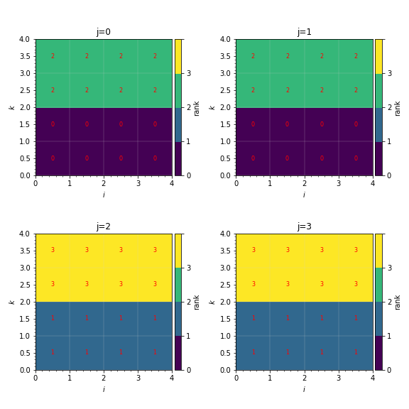

Visualizing a distribution mapping
==================================

WarpX provides via :ref:`reduced diagnostics <reduced-diagnostics>` an output
:ref:`LoadBalanceCosts <running-cpp-parameters-diagnostics>`, which
allows for visualization of a simulation's distribution mapping and computational
costs. Here we demonstrate the workflow for generating this data and using it to
plot distribution mappings and load balance costs.

Generating the data
-------------------

To generate 'Load Balance Costs' reduced diagnostics output, WarpX should be run
with the following lines added to the input file (the name of the reduced diagnostics
file, `LBC`, and interval in steps to output reduced diagnostics data, `100`, may
be changed as needed):

.. code-block:: python

    warpx.reduced_diags_names = LBC
    LBC.type = LoadBalanceCosts
    LBC.frequency = 100

The line `warpx.reduced_diags_names = LBC` sets the name of the reduced diagnostics
output file to `LBC`.  The next line `LBC.type = LoadBalanceCosts` tells WarpX
that the reduced diagnostics is a `LoadBalanceCosts` diagnostic, and instructs
WarpX to record costs and rank layouts.  The final line, `LBC.frequency = 100`,
controls the interval for output of this reduced diagnostic's data.

Loading and plotting the data
-----------------------------

After generating data (called `LBC_knapsack.txt` and `LBC_sfc.txt` in the example
below), the following Python code, along with a helper class in
:download:`plot_distribution_mapping.py<../../../Tools/PostProcessing/plot_distribution_mapping.py>`
can be used to read the data:

.. code-block:: python

    # Math
    import numpy as np
    import random

    # Plotting
    import matplotlib.pyplot as plt
    import matplotlib as mpl
    from matplotlib.colors import ListedColormap
    from mpl_toolkits.axes_grid1 import make_axes_locatable

    # Data handling
    import plot_distribution_mapping as pdm

    sim_knapsack = pdm.SimData('LBC_knapsack.txt', # Data directory
                               [2800]              # Files to process
                              )
    sim_sfc = pdm.SimData('LBC_sfc.txt', [2800])

    # Set reduced diagnostics data for step 2800
    for sim in [sim_knapsack, sim_sfc]: sim(2800)

For 2D data, the following function can be used for visualization of distribution
mappings:

.. code-block:: python

    # Plotting -- we know beforehand the data is 2D
    def plot(sim):
        """
        Plot MPI rank layout for a set of `LoadBalanceCosts` reduced diagnostics
        (2D) data.

        Arguments:
        sim -- SimData class with data (2D) loaded for desired iteration
        """
        # Make first cmap
        cmap = plt.cm.nipy_spectral
        cmaplist = [cmap(i) for i in range(cmap.N)][::-1]
        unique_ranks = np.unique(sim.rank_arr)
        sz = len(unique_ranks)
        cmap = mpl.colors.LinearSegmentedColormap.from_list(
            'my_cmap', cmaplist, sz) # create the new map

        # Make cmap from 1 --> 96 then randomize
        cmaplist= [cmap(i) for i in range(sz)]
        random.Random(6).shuffle(cmaplist)
        cmap = mpl.colors.LinearSegmentedColormap.from_list(
            'my_cmap', cmaplist, sz) # create the new map

        # Define the bins and normalize
        bounds = np.linspace(0, sz, sz + 1)
        norm = mpl.colors.BoundaryNorm(bounds, sz)

        my, mx = sim.rank_arr.shape
        xcoord, ycoord = np.linspace(0,mx,mx+1), np.linspace(0,my,my+1)
        im = plt.pcolormesh(xcoord, ycoord, sim.rank_arr,
                            cmap=cmap, norm=norm)

        # Grid lines
        plt.ylabel('$j$')
        plt.xlabel('$i$')
        plt.minorticks_on()
        plt.hlines(ycoord, xcoord[0], xcoord[-1],
                   alpha=0.7, linewidth=0.3, color='lightgrey')
        plt.vlines(xcoord, ycoord[0], ycoord[-1],
                   alpha=0.7, linewidth=0.3, color='lightgrey')

        plt.gca().set_aspect('equal')

        # Center rank label
        for j in range(my):
            for i in range(mx):
                text = plt.gca().text(i+0.5, j+0.5, int(sim.rank_arr[j][i]),
                                      ha="center", va="center",
                                      color="w", fontsize=8)

        # Colorbar
        divider = make_axes_locatable(plt.gca())
        cax = divider.new_horizontal(size="5%", pad=0.05)
        plt.gcf().add_axes(cax)
        cb=plt.gcf().colorbar(im, label='rank', cax=cax, orientation="vertical")
        minorticks = np.linspace(0, 1, len(unique_ranks) + 1)
        cb.ax.yaxis.set_ticks(minorticks, minor=True)

The function can be used as follows:

.. code-block:: python

    fig, axs = plt.subplots(1, 2, figsize=(12, 6))
    plt.sca(axs[0])
    plt.title('Knapsack')
    plot(sim_knapsack)
    plt.sca(axs[1])
    plt.title('SFC')
    plot(sim_sfc)
    plt.tight_layout()

The generates plots like in `[fig:knapsack_sfc_distribution_mapping_2D] <#fig:knapsack_sfc_distribution_mapping_2D>`__:

.. raw:: latex

   \centering

   Sample distribution mappings from simulations with knapsack (left) and space-filling curve (right) policies for update of the distribution mapping when load balancing.

Similarly, the computational costs per box can be plotted with the following code:

.. code-block:: python

    fig, axs = plt.subplots(1, 2, figsize=(12, 6))
    plt.sca(axs[0])
    plt.title('Knapsack')
    plt.pcolormesh(sim_knapsack.cost_arr)
    plt.sca(axs[1])
    plt.title('SFC')
    plt.pcolormesh(sim_sfc.cost_arr)

    for ax in axs:
        plt.sca(ax)
        plt.ylabel('$j$')
        plt.xlabel('$i$')
        ax.set_aspect('equal')

    plt.tight_layout()

This generates plots like in `[fig:knapsack_sfc_costs_2D] <#fig:knapsack_sfc_costs_2D>`__:

.. raw:: latex

   \centering

.. figure:: knapsack_sfc_costs_2D.png
   :alt: Sample computational cost per box from simulations with knapsack (left) and space-filling curve (right) policies for update of the distribution mapping when load balancing.
   :name: fig:knapsack_sfc_costs_2D
   :width: 15cm

   Sample computational cost per box from simulations with knapsack (left) and space-filling curve (right) policies for update of the distribution mapping when load balancing.

Loading 3D data works the same as loading 2D data, but this time the cost and
rank arrays will be 3 dimensional.  Here we load and plot some example 3D data
(`LBC_3D.txt`) from a simulation run on 4 MPI ranks.  Particles fill the box
from :math:`k=0` to :math:`k=1`.

.. code-block:: python

    sim_3D = pdm.SimData('LBC_3D.txt', [1,2,3])
    sim_3D(1)

    # Plotting -- we know beforehand the data is 3D
    def plot_3D(sim, j0):
        """
        Plot MPI rank layout for a set of `LoadBalanceCosts` reduced diagnostics
        (3D) data.

        Arguments:
        sim -- SimData class with data (3D) loaded for desired iteration
        j0 -- slice along j direction to plot ik slice
        """
        # Make first cmap
        cmap = plt.cm.viridis
        cmaplist = [cmap(i) for i in range(cmap.N)][::-1]
        unique_ranks = np.unique(sim.rank_arr)
        sz = len(unique_ranks)
        cmap = mpl.colors.LinearSegmentedColormap.from_list(
            'my_cmap', cmaplist, sz) # create the new map

        # Make cmap from 1 --> 96 then randomize
        cmaplist= [cmap(i) for i in range(sz)]
        random.Random(6).shuffle(cmaplist)
        cmap = mpl.colors.LinearSegmentedColormap.from_list(
            'my_cmap', cmaplist, sz) # create the new map

        # Define the bins and normalize
        bounds = np.linspace(0, sz, sz + 1)
        norm = mpl.colors.BoundaryNorm(bounds, sz)

        mz, my, mx = sim.rank_arr.shape
        xcoord, ycoord, zcoord = np.linspace(0,mx,mx+1), np.linspace(0,my,my+1),
                                                         np.linspace(0,mz,mz+1)
        im = plt.pcolormesh(xcoord, zcoord, sim.rank_arr[:,j0,:],
                            cmap=cmap, norm=norm)

        # Grid lines
        plt.ylabel('$k$')
        plt.xlabel('$i$')
        plt.minorticks_on()
        plt.hlines(zcoord, xcoord[0], xcoord[-1],
                   alpha=0.7, linewidth=0.3, color='lightgrey')
        plt.vlines(xcoord, zcoord[0], zcoord[-1],
                   alpha=0.7, linewidth=0.3, color='lightgrey')

        plt.gca().set_aspect('equal')

        # Center rank label
        for k in range(mz):
            for i in range(mx):
                text = plt.gca().text(i+0.5, k+0.5, int(sim.rank_arr[k][j0][i]),
                                      ha="center", va="center",
                                      color="red", fontsize=8)

        # Colorbar
        divider = make_axes_locatable(plt.gca())
        cax = divider.new_horizontal(size="5%", pad=0.05)
        plt.gcf().add_axes(cax)
        cb=plt.gcf().colorbar(im, label='rank', cax=cax, orientation="vertical")
        ticks = np.linspace(0, 1, len(unique_ranks)+1)
        cb.ax.yaxis.set_ticks(ticks)
        cb.ax.yaxis.set_ticklabels([0, 1, 2, 3, " "])

    fig, axs = plt.subplots(2, 2, figsize=(8, 8))
    for j,ax in enumerate(axs.flatten()):
        plt.sca(ax)
        plt.title('j={}'.format(j))
        plot_3D(sim_3D, j)
        plt.tight_layout()

This generates plots like in `[fig:distribution_mapping_3D] <#fig:distribution_mapping_3D>`__:

.. raw:: latex

   \centering

   Sample distribution mappings from 3D simulations, visualized as slices in the :math:`ik` plane along :math:`j`.
